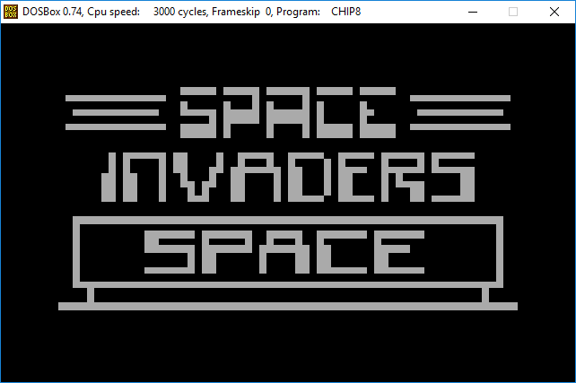

# chip-8-dos
CHIP-8 Emulator (DOS)

Built with [Turbo C 2.01](http://cc.embarcadero.com/item/25636) running on [DOSBox](http://www.dosbox.com)

Ported from [chip8](https://github.com/diogoeichert/chip-8)

Uses 4 different ASCII characters to draw graphics in text mode.

Public-domain ROMs can be found [here](/roms)
